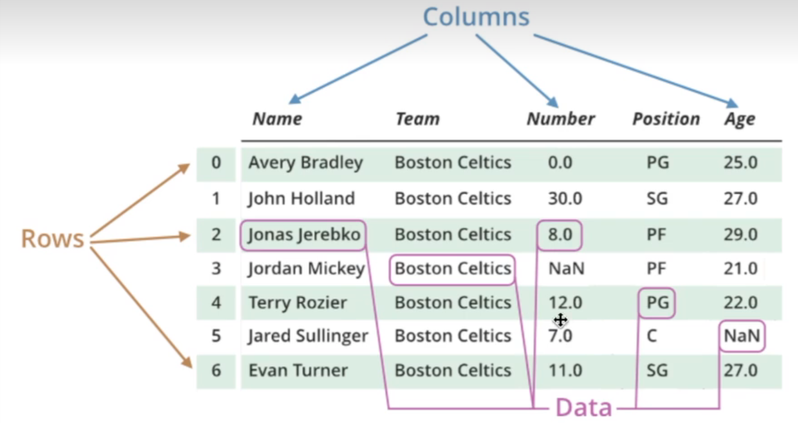

### 1.利用list创建Series

import pandas as pd
import numpy as np
random_items = np.random.randint(25,size = (10))
random_items


```python
# 将生成的list转化为Series
my_series = pd.Series(random_items)
my_series
```


    0     1
    1    23
    2     3
    3    20
    4    24
    5    19
    6    14
    7    12
    8     9
    9    20
    dtype: int32


```python
# 访问每一个元素
my_series[2]
```


    3


```python
letter_indexs = ['a','b','c','d','e','f','g','h','i','j']
my_series_new = pd.Series(random_items,letter_indexs)
my_series_new
```


    a     1
    b    23
    c     3
    d    20
    e    24
    f    19
    g    14
    h    12
    i     9
    j    20
    dtype: int32


### 2.利用字典创建Series


```python
dict = {'a':     1,
'b'  :  23,
'c'   :  3,
'd'   :  20,
'e' :   24}
my_series1 = pd.Series(dict)
my_series1
```


    a     1
    b    23
    c     3
    d    20
    e    24
    dtype: int64


```python
print(f'中位数为{my_series_new.median()}，以下是大于它的部分：')
my_series_new[my_series_new > my_series_new.median()]
```

    中位数为16.5，以下是大于它的部分：
    


    b    23
    d    20
    e    24
    f    19
    j    20
    dtype: int32


### 3.DataFrame

DataFrame不仅有行标签，也有列标签。


```python
MyData = pd.read_csv('Narrativedata.csv') # pd.read_csv直接返回一个DataFrame数据
MyData.head()
```


<div>
<style scoped>
    .dataframe tbody tr th:only-of-type {
        vertical-align: middle;
    }

    .dataframe tbody tr th {
        vertical-align: top;
    }

    .dataframe thead th {
        text-align: right;
    }
</style>
<table border="1" class="dataframe">
  <thead>
    <tr style="text-align: right;">
      <th></th>
      <th>PassengerId</th>
      <th>Survived</th>
      <th>Pclass</th>
      <th>Name</th>
      <th>Sex</th>
      <th>Age</th>
      <th>SibSp</th>
      <th>Parch</th>
      <th>Ticket</th>
      <th>Fare</th>
      <th>Cabin</th>
      <th>Embarked</th>
    </tr>
  </thead>
  <tbody>
    <tr>
      <th>0</th>
      <td>1</td>
      <td>0</td>
      <td>3</td>
      <td>Braund, Mr. Owen Harris</td>
      <td>male</td>
      <td>22.0</td>
      <td>1</td>
      <td>0</td>
      <td>A/5 21171</td>
      <td>7.2500</td>
      <td>NaN</td>
      <td>S</td>
    </tr>
    <tr>
      <th>1</th>
      <td>2</td>
      <td>1</td>
      <td>1</td>
      <td>Cumings, Mrs. John Bradley (Florence Briggs Th...</td>
      <td>female</td>
      <td>38.0</td>
      <td>1</td>
      <td>0</td>
      <td>PC 17599</td>
      <td>71.2833</td>
      <td>C85</td>
      <td>C</td>
    </tr>
    <tr>
      <th>2</th>
      <td>3</td>
      <td>1</td>
      <td>3</td>
      <td>Heikkinen, Miss. Laina</td>
      <td>female</td>
      <td>26.0</td>
      <td>0</td>
      <td>0</td>
      <td>STON/O2. 3101282</td>
      <td>7.9250</td>
      <td>NaN</td>
      <td>S</td>
    </tr>
    <tr>
      <th>3</th>
      <td>4</td>
      <td>1</td>
      <td>1</td>
      <td>Futrelle, Mrs. Jacques Heath (Lily May Peel)</td>
      <td>female</td>
      <td>35.0</td>
      <td>1</td>
      <td>0</td>
      <td>113803</td>
      <td>53.1000</td>
      <td>C123</td>
      <td>S</td>
    </tr>
    <tr>
      <th>4</th>
      <td>5</td>
      <td>0</td>
      <td>3</td>
      <td>Allen, Mr. William Henry</td>
      <td>male</td>
      <td>35.0</td>
      <td>0</td>
      <td>0</td>
      <td>373450</td>
      <td>8.0500</td>
      <td>NaN</td>
      <td>S</td>
    </tr>
  </tbody>
</table>
</div>


```python
MyNewData = pd.read_csv('Narrativedata.csv',index_col=0) # 加不加index_col=0的区别
MyNewData.head()
```


<div>
<style scoped>
    .dataframe tbody tr th:only-of-type {
        vertical-align: middle;
    }

    .dataframe tbody tr th {
        vertical-align: top;
    }

    .dataframe thead th {
        text-align: right;
    }
</style>
<table border="1" class="dataframe">
  <thead>
    <tr style="text-align: right;">
      <th></th>
      <th>Survived</th>
      <th>Pclass</th>
      <th>Name</th>
      <th>Sex</th>
      <th>Age</th>
      <th>SibSp</th>
      <th>Parch</th>
      <th>Ticket</th>
      <th>Fare</th>
      <th>Cabin</th>
      <th>Embarked</th>
    </tr>
    <tr>
      <th>PassengerId</th>
      <th></th>
      <th></th>
      <th></th>
      <th></th>
      <th></th>
      <th></th>
      <th></th>
      <th></th>
      <th></th>
      <th></th>
      <th></th>
    </tr>
  </thead>
  <tbody>
    <tr>
      <th>1</th>
      <td>0</td>
      <td>3</td>
      <td>Braund, Mr. Owen Harris</td>
      <td>male</td>
      <td>22.0</td>
      <td>1</td>
      <td>0</td>
      <td>A/5 21171</td>
      <td>7.2500</td>
      <td>NaN</td>
      <td>S</td>
    </tr>
    <tr>
      <th>2</th>
      <td>1</td>
      <td>1</td>
      <td>Cumings, Mrs. John Bradley (Florence Briggs Th...</td>
      <td>female</td>
      <td>38.0</td>
      <td>1</td>
      <td>0</td>
      <td>PC 17599</td>
      <td>71.2833</td>
      <td>C85</td>
      <td>C</td>
    </tr>
    <tr>
      <th>3</th>
      <td>1</td>
      <td>3</td>
      <td>Heikkinen, Miss. Laina</td>
      <td>female</td>
      <td>26.0</td>
      <td>0</td>
      <td>0</td>
      <td>STON/O2. 3101282</td>
      <td>7.9250</td>
      <td>NaN</td>
      <td>S</td>
    </tr>
    <tr>
      <th>4</th>
      <td>1</td>
      <td>1</td>
      <td>Futrelle, Mrs. Jacques Heath (Lily May Peel)</td>
      <td>female</td>
      <td>35.0</td>
      <td>1</td>
      <td>0</td>
      <td>113803</td>
      <td>53.1000</td>
      <td>C123</td>
      <td>S</td>
    </tr>
    <tr>
      <th>5</th>
      <td>0</td>
      <td>3</td>
      <td>Allen, Mr. William Henry</td>
      <td>male</td>
      <td>35.0</td>
      <td>0</td>
      <td>0</td>
      <td>373450</td>
      <td>8.0500</td>
      <td>NaN</td>
      <td>S</td>
    </tr>
  </tbody>
</table>
</div>


```python
data1 = [[-1,2],[-0.5,6],[0,10],[1,18]]
pd.DataFrame(data1) # 通过pandas查看数据结构
```


<div>
<style scoped>
    .dataframe tbody tr th:only-of-type {
        vertical-align: middle;
    }

    .dataframe tbody tr th {
        vertical-align: top;
    }

    .dataframe thead th {
        text-align: right;
    }
</style>
<table border="1" class="dataframe">
  <thead>
    <tr style="text-align: right;">
      <th></th>
      <th>0</th>
      <th>1</th>
    </tr>
  </thead>
  <tbody>
    <tr>
      <th>0</th>
      <td>-1.0</td>
      <td>2</td>
    </tr>
    <tr>
      <th>1</th>
      <td>-0.5</td>
      <td>6</td>
    </tr>
    <tr>
      <th>2</th>
      <td>0.0</td>
      <td>10</td>
    </tr>
    <tr>
      <th>3</th>
      <td>1.0</td>
      <td>18</td>
    </tr>
  </tbody>
</table>
</div>


```python
# data2 = {'a':[1,2,3,4],'b':[5,6,7,8],'c':[9,10,11]}
# pd.DataFrame(data2) # 通过pandas查看数据结构
# ValueError: All arrays must be of the same length
data2 = {'a':[1,2,3,4],'b':[5,6,7,8],'c':[9,10,11,12]}
data2 = pd.DataFrame(data2) # 通过pandas查看数据结构
data2
```


<div>
<style scoped>
    .dataframe tbody tr th:only-of-type {
        vertical-align: middle;
    }

    .dataframe tbody tr th {
        vertical-align: top;
    }

    .dataframe thead th {
        text-align: right;
    }
</style>
<table border="1" class="dataframe">
  <thead>
    <tr style="text-align: right;">
      <th></th>
      <th>a</th>
      <th>b</th>
      <th>c</th>
    </tr>
  </thead>
  <tbody>
    <tr>
      <th>0</th>
      <td>1</td>
      <td>5</td>
      <td>9</td>
    </tr>
    <tr>
      <th>1</th>
      <td>2</td>
      <td>6</td>
      <td>10</td>
    </tr>
    <tr>
      <th>2</th>
      <td>3</td>
      <td>7</td>
      <td>11</td>
    </tr>
    <tr>
      <th>3</th>
      <td>4</td>
      <td>8</td>
      <td>12</td>
    </tr>
  </tbody>
</table>
</div>


```python
# 查看数据类型
type(data2)
```


    pandas.core.frame.DataFrame


```python
type(data2['a'])
```


    pandas.core.series.Series


```python
data3 = {'locke':pd.Series(random_items,letter_indexs),'mill':pd.Series(random_items,letter_indexs)}
data3 = pd.DataFrame(data3) # 通过pandas查看数据结构
data3
```


<div>
<style scoped>
    .dataframe tbody tr th:only-of-type {
        vertical-align: middle;
    }

    .dataframe tbody tr th {
        vertical-align: top;
    }

    .dataframe thead th {
        text-align: right;
    }
</style>
<table border="1" class="dataframe">
  <thead>
    <tr style="text-align: right;">
      <th></th>
      <th>locke</th>
      <th>mill</th>
    </tr>
  </thead>
  <tbody>
    <tr>
      <th>a</th>
      <td>1</td>
      <td>1</td>
    </tr>
    <tr>
      <th>b</th>
      <td>23</td>
      <td>23</td>
    </tr>
    <tr>
      <th>c</th>
      <td>3</td>
      <td>3</td>
    </tr>
    <tr>
      <th>d</th>
      <td>20</td>
      <td>20</td>
    </tr>
    <tr>
      <th>e</th>
      <td>24</td>
      <td>24</td>
    </tr>
    <tr>
      <th>f</th>
      <td>19</td>
      <td>19</td>
    </tr>
    <tr>
      <th>g</th>
      <td>14</td>
      <td>14</td>
    </tr>
    <tr>
      <th>h</th>
      <td>12</td>
      <td>12</td>
    </tr>
    <tr>
      <th>i</th>
      <td>9</td>
      <td>9</td>
    </tr>
    <tr>
      <th>j</th>
      <td>20</td>
      <td>20</td>
    </tr>
  </tbody>
</table>
</div>


```python
data3.reset_index()
```


<div>
<style scoped>
    .dataframe tbody tr th:only-of-type {
        vertical-align: middle;
    }

    .dataframe tbody tr th {
        vertical-align: top;
    }

    .dataframe thead th {
        text-align: right;
    }
</style>
<table border="1" class="dataframe">
  <thead>
    <tr style="text-align: right;">
      <th></th>
      <th>index</th>
      <th>locke</th>
      <th>mill</th>
    </tr>
  </thead>
  <tbody>
    <tr>
      <th>0</th>
      <td>a</td>
      <td>1</td>
      <td>1</td>
    </tr>
    <tr>
      <th>1</th>
      <td>b</td>
      <td>23</td>
      <td>23</td>
    </tr>
    <tr>
      <th>2</th>
      <td>c</td>
      <td>3</td>
      <td>3</td>
    </tr>
    <tr>
      <th>3</th>
      <td>d</td>
      <td>20</td>
      <td>20</td>
    </tr>
    <tr>
      <th>4</th>
      <td>e</td>
      <td>24</td>
      <td>24</td>
    </tr>
    <tr>
      <th>5</th>
      <td>f</td>
      <td>19</td>
      <td>19</td>
    </tr>
    <tr>
      <th>6</th>
      <td>g</td>
      <td>14</td>
      <td>14</td>
    </tr>
    <tr>
      <th>7</th>
      <td>h</td>
      <td>12</td>
      <td>12</td>
    </tr>
    <tr>
      <th>8</th>
      <td>i</td>
      <td>9</td>
      <td>9</td>
    </tr>
    <tr>
      <th>9</th>
      <td>j</td>
      <td>20</td>
      <td>20</td>
    </tr>
  </tbody>
</table>
</div>


```python
data3.reset_index(drop = True)
```


<div>
<style scoped>
    .dataframe tbody tr th:only-of-type {
        vertical-align: middle;
    }

    .dataframe tbody tr th {
        vertical-align: top;
    }

    .dataframe thead th {
        text-align: right;
    }
</style>
<table border="1" class="dataframe">
  <thead>
    <tr style="text-align: right;">
      <th></th>
      <th>locke</th>
      <th>mill</th>
    </tr>
  </thead>
  <tbody>
    <tr>
      <th>0</th>
      <td>1</td>
      <td>1</td>
    </tr>
    <tr>
      <th>1</th>
      <td>23</td>
      <td>23</td>
    </tr>
    <tr>
      <th>2</th>
      <td>3</td>
      <td>3</td>
    </tr>
    <tr>
      <th>3</th>
      <td>20</td>
      <td>20</td>
    </tr>
    <tr>
      <th>4</th>
      <td>24</td>
      <td>24</td>
    </tr>
    <tr>
      <th>5</th>
      <td>19</td>
      <td>19</td>
    </tr>
    <tr>
      <th>6</th>
      <td>14</td>
      <td>14</td>
    </tr>
    <tr>
      <th>7</th>
      <td>12</td>
      <td>12</td>
    </tr>
    <tr>
      <th>8</th>
      <td>9</td>
      <td>9</td>
    </tr>
    <tr>
      <th>9</th>
      <td>20</td>
      <td>20</td>
    </tr>
  </tbody>
</table>
</div>


```python
data3
```


<div>
<style scoped>
    .dataframe tbody tr th:only-of-type {
        vertical-align: middle;
    }

    .dataframe tbody tr th {
        vertical-align: top;
    }

    .dataframe thead th {
        text-align: right;
    }
</style>
<table border="1" class="dataframe">
  <thead>
    <tr style="text-align: right;">
      <th></th>
      <th>locke</th>
      <th>mill</th>
    </tr>
  </thead>
  <tbody>
    <tr>
      <th>a</th>
      <td>1</td>
      <td>1</td>
    </tr>
    <tr>
      <th>b</th>
      <td>23</td>
      <td>23</td>
    </tr>
    <tr>
      <th>c</th>
      <td>3</td>
      <td>3</td>
    </tr>
    <tr>
      <th>d</th>
      <td>20</td>
      <td>20</td>
    </tr>
    <tr>
      <th>e</th>
      <td>24</td>
      <td>24</td>
    </tr>
    <tr>
      <th>f</th>
      <td>19</td>
      <td>19</td>
    </tr>
    <tr>
      <th>g</th>
      <td>14</td>
      <td>14</td>
    </tr>
    <tr>
      <th>h</th>
      <td>12</td>
      <td>12</td>
    </tr>
    <tr>
      <th>i</th>
      <td>9</td>
      <td>9</td>
    </tr>
    <tr>
      <th>j</th>
      <td>20</td>
      <td>20</td>
    </tr>
  </tbody>
</table>
</div>


```python
data3.reset_index(drop = True,inplace = True)
data3
```


<div>
<style scoped>
    .dataframe tbody tr th:only-of-type {
        vertical-align: middle;
    }

    .dataframe tbody tr th {
        vertical-align: top;
    }

    .dataframe thead th {
        text-align: right;
    }
</style>
<table border="1" class="dataframe">
  <thead>
    <tr style="text-align: right;">
      <th></th>
      <th>locke</th>
      <th>mill</th>
    </tr>
  </thead>
  <tbody>
    <tr>
      <th>0</th>
      <td>1</td>
      <td>1</td>
    </tr>
    <tr>
      <th>1</th>
      <td>23</td>
      <td>23</td>
    </tr>
    <tr>
      <th>2</th>
      <td>3</td>
      <td>3</td>
    </tr>
    <tr>
      <th>3</th>
      <td>20</td>
      <td>20</td>
    </tr>
    <tr>
      <th>4</th>
      <td>24</td>
      <td>24</td>
    </tr>
    <tr>
      <th>5</th>
      <td>19</td>
      <td>19</td>
    </tr>
    <tr>
      <th>6</th>
      <td>14</td>
      <td>14</td>
    </tr>
    <tr>
      <th>7</th>
      <td>12</td>
      <td>12</td>
    </tr>
    <tr>
      <th>8</th>
      <td>9</td>
      <td>9</td>
    </tr>
    <tr>
      <th>9</th>
      <td>20</td>
      <td>20</td>
    </tr>
  </tbody>
</table>
</div>


```python
MyNewData.columns
```


    Index(['Survived', 'Pclass', 'Name', 'Sex', 'Age', 'SibSp', 'Parch', 'Ticket',
           'Fare', 'Cabin', 'Embarked'],
          dtype='object')


```python
MyData.columns # 多了个PassengerId
```


    Index(['PassengerId', 'Survived', 'Pclass', 'Name', 'Sex', 'Age', 'SibSp',
           'Parch', 'Ticket', 'Fare', 'Cabin', 'Embarked'],
          dtype='object')


```python
MyNewData['Name']
```


    PassengerId
    1                                Braund, Mr. Owen Harris
    2      Cumings, Mrs. John Bradley (Florence Briggs Th...
    3                                 Heikkinen, Miss. Laina
    4           Futrelle, Mrs. Jacques Heath (Lily May Peel)
    5                               Allen, Mr. William Henry
                                 ...                        
    887                                Montvila, Rev. Juozas
    888                         Graham, Miss. Margaret Edith
    889             Johnston, Miss. Catherine Helen "Carrie"
    890                                Behr, Mr. Karl Howell
    891                                  Dooley, Mr. Patrick
    Name: Name, Length: 891, dtype: object


```python
# 获取多列(columns)的信息
MyNewData[['Name','Ticket']]
```


<div>
<style scoped>
    .dataframe tbody tr th:only-of-type {
        vertical-align: middle;
    }

    .dataframe tbody tr th {
        vertical-align: top;
    }

    .dataframe thead th {
        text-align: right;
    }
</style>
<table border="1" class="dataframe">
  <thead>
    <tr style="text-align: right;">
      <th></th>
      <th>Name</th>
      <th>Ticket</th>
    </tr>
    <tr>
      <th>PassengerId</th>
      <th></th>
      <th></th>
    </tr>
  </thead>
  <tbody>
    <tr>
      <th>1</th>
      <td>Braund, Mr. Owen Harris</td>
      <td>A/5 21171</td>
    </tr>
    <tr>
      <th>2</th>
      <td>Cumings, Mrs. John Bradley (Florence Briggs Th...</td>
      <td>PC 17599</td>
    </tr>
    <tr>
      <th>3</th>
      <td>Heikkinen, Miss. Laina</td>
      <td>STON/O2. 3101282</td>
    </tr>
    <tr>
      <th>4</th>
      <td>Futrelle, Mrs. Jacques Heath (Lily May Peel)</td>
      <td>113803</td>
    </tr>
    <tr>
      <th>5</th>
      <td>Allen, Mr. William Henry</td>
      <td>373450</td>
    </tr>
    <tr>
      <th>...</th>
      <td>...</td>
      <td>...</td>
    </tr>
    <tr>
      <th>887</th>
      <td>Montvila, Rev. Juozas</td>
      <td>211536</td>
    </tr>
    <tr>
      <th>888</th>
      <td>Graham, Miss. Margaret Edith</td>
      <td>112053</td>
    </tr>
    <tr>
      <th>889</th>
      <td>Johnston, Miss. Catherine Helen "Carrie"</td>
      <td>W./C. 6607</td>
    </tr>
    <tr>
      <th>890</th>
      <td>Behr, Mr. Karl Howell</td>
      <td>111369</td>
    </tr>
    <tr>
      <th>891</th>
      <td>Dooley, Mr. Patrick</td>
      <td>370376</td>
    </tr>
  </tbody>
</table>
<p>891 rows × 2 columns</p>
</div>


```python
# 获取行(rows)的信息
MyNewData.iloc[20]
```


    Survived                       0
    Pclass                         2
    Name        Fynney, Mr. Joseph J
    Sex                         male
    Age                         35.0
    SibSp                          0
    Parch                          0
    Ticket                    239865
    Fare                        26.0
    Cabin                        NaN
    Embarked                       S
    Name: 21, dtype: object


```python
# 获取多行(rows)的信息
MyNewData.iloc[[20,21,22,23]]
```


<div>
<style scoped>
    .dataframe tbody tr th:only-of-type {
        vertical-align: middle;
    }

    .dataframe tbody tr th {
        vertical-align: top;
    }

    .dataframe thead th {
        text-align: right;
    }
</style>
<table border="1" class="dataframe">
  <thead>
    <tr style="text-align: right;">
      <th></th>
      <th>Survived</th>
      <th>Pclass</th>
      <th>Name</th>
      <th>Sex</th>
      <th>Age</th>
      <th>SibSp</th>
      <th>Parch</th>
      <th>Ticket</th>
      <th>Fare</th>
      <th>Cabin</th>
      <th>Embarked</th>
    </tr>
    <tr>
      <th>PassengerId</th>
      <th></th>
      <th></th>
      <th></th>
      <th></th>
      <th></th>
      <th></th>
      <th></th>
      <th></th>
      <th></th>
      <th></th>
      <th></th>
    </tr>
  </thead>
  <tbody>
    <tr>
      <th>21</th>
      <td>0</td>
      <td>2</td>
      <td>Fynney, Mr. Joseph J</td>
      <td>male</td>
      <td>35.0</td>
      <td>0</td>
      <td>0</td>
      <td>239865</td>
      <td>26.0000</td>
      <td>NaN</td>
      <td>S</td>
    </tr>
    <tr>
      <th>22</th>
      <td>1</td>
      <td>2</td>
      <td>Beesley, Mr. Lawrence</td>
      <td>male</td>
      <td>34.0</td>
      <td>0</td>
      <td>0</td>
      <td>248698</td>
      <td>13.0000</td>
      <td>D56</td>
      <td>S</td>
    </tr>
    <tr>
      <th>23</th>
      <td>1</td>
      <td>3</td>
      <td>McGowan, Miss. Anna "Annie"</td>
      <td>female</td>
      <td>15.0</td>
      <td>0</td>
      <td>0</td>
      <td>330923</td>
      <td>8.0292</td>
      <td>NaN</td>
      <td>Q</td>
    </tr>
    <tr>
      <th>24</th>
      <td>1</td>
      <td>1</td>
      <td>Sloper, Mr. William Thompson</td>
      <td>male</td>
      <td>28.0</td>
      <td>0</td>
      <td>0</td>
      <td>113788</td>
      <td>35.5000</td>
      <td>A6</td>
      <td>S</td>
    </tr>
  </tbody>
</table>
</div>


```python
MyNewData['Name'] = MyNewData['Name'].str.strip()  # 去除name列中开头和结尾的空格
```


```python
MyNewDataC =MyNewData.set_index(['Name'],drop = True)
MyNewDataC
```


<div>
<style scoped>
    .dataframe tbody tr th:only-of-type {
        vertical-align: middle;
    }

    .dataframe tbody tr th {
        vertical-align: top;
    }

    .dataframe thead th {
        text-align: right;
    }
</style>
<table border="1" class="dataframe">
  <thead>
    <tr style="text-align: right;">
      <th></th>
      <th>Survived</th>
      <th>Pclass</th>
      <th>Sex</th>
      <th>Age</th>
      <th>SibSp</th>
      <th>Parch</th>
      <th>Ticket</th>
      <th>Fare</th>
      <th>Cabin</th>
      <th>Embarked</th>
    </tr>
    <tr>
      <th>Name</th>
      <th></th>
      <th></th>
      <th></th>
      <th></th>
      <th></th>
      <th></th>
      <th></th>
      <th></th>
      <th></th>
      <th></th>
    </tr>
  </thead>
  <tbody>
    <tr>
      <th>Braund, Mr. Owen Harris</th>
      <td>0</td>
      <td>3</td>
      <td>male</td>
      <td>22.0</td>
      <td>1</td>
      <td>0</td>
      <td>A/5 21171</td>
      <td>7.2500</td>
      <td>NaN</td>
      <td>S</td>
    </tr>
    <tr>
      <th>Cumings, Mrs. John Bradley (Florence Briggs Thayer)</th>
      <td>1</td>
      <td>1</td>
      <td>female</td>
      <td>38.0</td>
      <td>1</td>
      <td>0</td>
      <td>PC 17599</td>
      <td>71.2833</td>
      <td>C85</td>
      <td>C</td>
    </tr>
    <tr>
      <th>Heikkinen, Miss. Laina</th>
      <td>1</td>
      <td>3</td>
      <td>female</td>
      <td>26.0</td>
      <td>0</td>
      <td>0</td>
      <td>STON/O2. 3101282</td>
      <td>7.9250</td>
      <td>NaN</td>
      <td>S</td>
    </tr>
    <tr>
      <th>Futrelle, Mrs. Jacques Heath (Lily May Peel)</th>
      <td>1</td>
      <td>1</td>
      <td>female</td>
      <td>35.0</td>
      <td>1</td>
      <td>0</td>
      <td>113803</td>
      <td>53.1000</td>
      <td>C123</td>
      <td>S</td>
    </tr>
    <tr>
      <th>Allen, Mr. William Henry</th>
      <td>0</td>
      <td>3</td>
      <td>male</td>
      <td>35.0</td>
      <td>0</td>
      <td>0</td>
      <td>373450</td>
      <td>8.0500</td>
      <td>NaN</td>
      <td>S</td>
    </tr>
    <tr>
      <th>...</th>
      <td>...</td>
      <td>...</td>
      <td>...</td>
      <td>...</td>
      <td>...</td>
      <td>...</td>
      <td>...</td>
      <td>...</td>
      <td>...</td>
      <td>...</td>
    </tr>
    <tr>
      <th>Montvila, Rev. Juozas</th>
      <td>0</td>
      <td>2</td>
      <td>male</td>
      <td>27.0</td>
      <td>0</td>
      <td>0</td>
      <td>211536</td>
      <td>13.0000</td>
      <td>NaN</td>
      <td>S</td>
    </tr>
    <tr>
      <th>Graham, Miss. Margaret Edith</th>
      <td>1</td>
      <td>1</td>
      <td>female</td>
      <td>19.0</td>
      <td>0</td>
      <td>0</td>
      <td>112053</td>
      <td>30.0000</td>
      <td>B42</td>
      <td>S</td>
    </tr>
    <tr>
      <th>Johnston, Miss. Catherine Helen "Carrie"</th>
      <td>0</td>
      <td>3</td>
      <td>female</td>
      <td>NaN</td>
      <td>1</td>
      <td>2</td>
      <td>W./C. 6607</td>
      <td>23.4500</td>
      <td>NaN</td>
      <td>S</td>
    </tr>
    <tr>
      <th>Behr, Mr. Karl Howell</th>
      <td>1</td>
      <td>1</td>
      <td>male</td>
      <td>26.0</td>
      <td>0</td>
      <td>0</td>
      <td>111369</td>
      <td>30.0000</td>
      <td>C148</td>
      <td>C</td>
    </tr>
    <tr>
      <th>Dooley, Mr. Patrick</th>
      <td>0</td>
      <td>3</td>
      <td>male</td>
      <td>32.0</td>
      <td>0</td>
      <td>0</td>
      <td>370376</td>
      <td>7.7500</td>
      <td>NaN</td>
      <td>Q</td>
    </tr>
  </tbody>
</table>
<p>891 rows × 10 columns</p>
</div>


```python
MyNewDataC.iloc[0]
```


    Survived            0
    Pclass              3
    Sex              male
    Age              22.0
    SibSp               1
    Parch               0
    Ticket      A/5 21171
    Fare             7.25
    Cabin             NaN
    Embarked            S
    Name: Braund, Mr. Owen Harris, dtype: object


```python
MyNewDataC.loc['Braund, Mr. Owen Harris'] # 与MyNewDataC.iloc[0]效果相同
```


    Survived            0
    Pclass              3
    Sex              male
    Age              22.0
    SibSp               1
    Parch               0
    Ticket      A/5 21171
    Fare             7.25
    Cabin             NaN
    Embarked            S
    Name: Braund, Mr. Owen Harris, dtype: object


```python
MyNewDataC.loc[['Braund, Mr. Owen Harris','Heikkinen, Miss. Laina'],['Sex','Fare']]
```


<div>
<style scoped>
    .dataframe tbody tr th:only-of-type {
        vertical-align: middle;
    }

    .dataframe tbody tr th {
        vertical-align: top;
    }

    .dataframe thead th {
        text-align: right;
    }
</style>
<table border="1" class="dataframe">
  <thead>
    <tr style="text-align: right;">
      <th></th>
      <th>Sex</th>
      <th>Fare</th>
    </tr>
    <tr>
      <th>Name</th>
      <th></th>
      <th></th>
    </tr>
  </thead>
  <tbody>
    <tr>
      <th>Braund, Mr. Owen Harris</th>
      <td>male</td>
      <td>7.250</td>
    </tr>
    <tr>
      <th>Heikkinen, Miss. Laina</th>
      <td>female</td>
      <td>7.925</td>
    </tr>
  </tbody>
</table>
</div>


```python
MyNewDataC.loc['Braund, Mr. Owen Harris':'Montvila, Rev. Juozas'  ,  'Sex':'Fare']
```


<div>
<style scoped>
    .dataframe tbody tr th:only-of-type {
        vertical-align: middle;
    }

    .dataframe tbody tr th {
        vertical-align: top;
    }

    .dataframe thead th {
        text-align: right;
    }
</style>
<table border="1" class="dataframe">
  <thead>
    <tr style="text-align: right;">
      <th></th>
      <th>Sex</th>
      <th>Age</th>
      <th>SibSp</th>
      <th>Parch</th>
      <th>Ticket</th>
      <th>Fare</th>
    </tr>
    <tr>
      <th>Name</th>
      <th></th>
      <th></th>
      <th></th>
      <th></th>
      <th></th>
      <th></th>
    </tr>
  </thead>
  <tbody>
    <tr>
      <th>Braund, Mr. Owen Harris</th>
      <td>male</td>
      <td>22.0</td>
      <td>1</td>
      <td>0</td>
      <td>A/5 21171</td>
      <td>7.2500</td>
    </tr>
    <tr>
      <th>Cumings, Mrs. John Bradley (Florence Briggs Thayer)</th>
      <td>female</td>
      <td>38.0</td>
      <td>1</td>
      <td>0</td>
      <td>PC 17599</td>
      <td>71.2833</td>
    </tr>
    <tr>
      <th>Heikkinen, Miss. Laina</th>
      <td>female</td>
      <td>26.0</td>
      <td>0</td>
      <td>0</td>
      <td>STON/O2. 3101282</td>
      <td>7.9250</td>
    </tr>
    <tr>
      <th>Futrelle, Mrs. Jacques Heath (Lily May Peel)</th>
      <td>female</td>
      <td>35.0</td>
      <td>1</td>
      <td>0</td>
      <td>113803</td>
      <td>53.1000</td>
    </tr>
    <tr>
      <th>Allen, Mr. William Henry</th>
      <td>male</td>
      <td>35.0</td>
      <td>0</td>
      <td>0</td>
      <td>373450</td>
      <td>8.0500</td>
    </tr>
    <tr>
      <th>...</th>
      <td>...</td>
      <td>...</td>
      <td>...</td>
      <td>...</td>
      <td>...</td>
      <td>...</td>
    </tr>
    <tr>
      <th>Dahlberg, Miss. Gerda Ulrika</th>
      <td>female</td>
      <td>22.0</td>
      <td>0</td>
      <td>0</td>
      <td>7552</td>
      <td>10.5167</td>
    </tr>
    <tr>
      <th>Banfield, Mr. Frederick James</th>
      <td>male</td>
      <td>28.0</td>
      <td>0</td>
      <td>0</td>
      <td>C.A./SOTON 34068</td>
      <td>10.5000</td>
    </tr>
    <tr>
      <th>Sutehall, Mr. Henry Jr</th>
      <td>male</td>
      <td>25.0</td>
      <td>0</td>
      <td>0</td>
      <td>SOTON/OQ 392076</td>
      <td>7.0500</td>
    </tr>
    <tr>
      <th>Rice, Mrs. William (Margaret Norton)</th>
      <td>female</td>
      <td>39.0</td>
      <td>0</td>
      <td>5</td>
      <td>382652</td>
      <td>29.1250</td>
    </tr>
    <tr>
      <th>Montvila, Rev. Juozas</th>
      <td>male</td>
      <td>27.0</td>
      <td>0</td>
      <td>0</td>
      <td>211536</td>
      <td>13.0000</td>
    </tr>
  </tbody>
</table>
<p>887 rows × 6 columns</p>
</div>


```python

```
